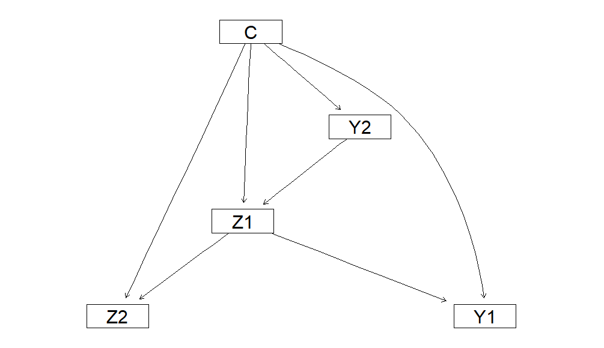
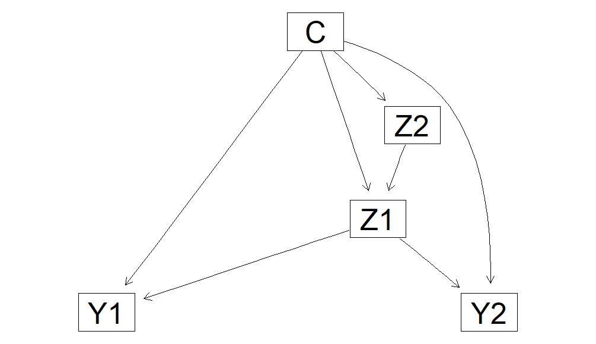

Structural learning of tree aumented naive Bayes using mixtures of
polynomials
================

This bundle contains the manuscript submitted to the Kybernetika and
entitled “*Structural learning of tree aumented naive Bayes using
mixtures of polynomial*”. The organisation is in the following folders:
- Core_functions: folder where the script for the main functions.
  Functions to compute the mutual information between variables using
  Mixtures of Polynomials and Conditional Linear Gaussian model.
- experimental_pipeline: folder where the scripts for experimentals are
  incluided.
- Datasets: folder where files .RDa with data for the experiments are incluided.
  datos.RDa contains continuous and discrete variables, while datosDisc.RDa
  contains only discrete variables. In this file, the continuous variables are
  discretized.

We also included the following files:
- example.R: A R file with a toy example for fit TAN models.
- data.Rda: A R data file with the toy dataset.

## Packages needed for running the code

The R packages needed for running the code could be downloaded
using Cran Repository. Using the following R commands to install the
packages:

``` r
# install.packages("bnlearn")
# install.packages("MASS")
# install.packages("infotheo")
# install.packages("MoTBFs")
# install.packages("logging")
```
## Core_functions
In this section, the description of the main scripts to build TAN models.

- mutualInformation.R: a R file where the functions for computing the mutual information
  using MoP distributions are implemented.
- fitTAN.R: a R file where the functions for building Mop--TAN models. This scripts
  including the following functions:
  - `fit_tan`. It computes the structural and the parameters of a TAN model
    given a data.frame considering the Mops.
  - `fit_tan_structure`. It computes the structure of a TAN model given a weight matrix.
  - `mutual_information_tan`. It computes the mutual information between each pair of
    estructure given the class variable.
  - `fit_root`. It computes a possible root for TAN model.
- fitTANGauss.R: a R file where the functions for building CG--TAN models, including the
  mutual information between variables.
  - `fit_tan_g`function. It computes the structural and the parameters of a TAN model
    given a data.frame considering the conditional Gaussian assumptions.
  - `fit_root_g`. It computes a possible root for TAN model.
  - `fit_tan_structure_g`.It computes the structure of a TAN model
    considering the conditional Gaussian assumptions given a mutual
    information matrix computed by `MI_tan_gauss`.
  - `MI_tan_gauss`. It computes the mutual information between each pair
    of feature variables given the class variable.
  - `cond_mi_cont` and `cond_mi_cont_disc`. They compute the mutual
    information of two predicted variables given the class using
    conditional Gaussian assumptions.


## Toy Example

The toy problem consists in a synthetic dataset with a class variable
*C*, two continuous features random variables, *Z1* and *Z2*, and two
discrete features random variables, *Y1* and *Y2*, following the
conditional Gaussian assumptions. The dataset contains 100 instances.

The following code load the toy problem dataset to the environment.

``` r
load("data.Rda")
```
### Computing MOP--TAN
First, we source the *fitTAN.R* and *mutualInformation.R* files to load the 
necessary functions to compute the MOP--TAN model.
``` r
# Source fitTANGauss.R file
source("fitTAN.R")
source("mutualInformation.R")
```

Now, the MoP TAN model can be computed using
`fit_tan`. This function requires *MoTBFs* package for the parameter
learning.

``` r
# MoTBFs R package is required for parameter learning process
library(MoTBFs)
library(logging)
tan = fit_tan(target = "C",data = data)
```
    ##
    ## 2026-09-21 12:07:48.584017 INFO::Learning Z1|C:Z2
    ## 2026-09-21 12:07:48.915246 INFO::Learning Z1|C:Y1
    ## 2026-09-21 12:07:49.101385 INFO::Learning Z1|C:Y2
    ## 2026-09-21 12:07:49.2279 INFO::Learning Z2|C:Z1
    ## 2026-09-21 12:07:49.542149 INFO::Learning Z2|C:Y1
    ## 2026-09-21 12:07:49.710326 INFO::Learning Z2|C:Y2
    ## 2026-09-21 12:07:49.864954 INFO::Learning Y1|C:Z1
    ## 2026-09-21 12:07:49.910206 INFO::Learning Y1|C:Z2
    ## 2026-09-21 12:07:49.925735 INFO::Learning Y1|C:Y2
    ## 2026-09-21 12:07:49.963467 INFO::Learning Y2|C:Z1
    ## 2026-09-21 12:07:49.979041 INFO::Learning Y2|C:Z2
    ## 2026-09-21 12:07:49.998535 INFO::Learning Y2|C:Y1

``` r
tan
```
    ##
    ## Potential(Z1 | Y2, C)
    ##Parent: Y2   	 Value =  "0" 
    ##Parent: C   	 Value =  "0" 
    ##[1] "0.376230453271747+0.179862589494777*Z1-0.15893109304528*Z1^2-0.043256707241674*Z1^3+0.0217031848509572*Z1^4"
    ##Parent: Y2   	 Value =  "0" 
    ##Parent: C   	 Value =  "1" 
    ##[1] "0.421157137661705+0.372854324560756*Z1-0.263659971391179*Z1^2-0.194149045836427*Z1^3+0.0764961294988855*Z1^4+0.0241165170755268*Z1^5-0.0081704749925162*Z1^6"
    ##Parent: Y2   	 Value =  "1" 
    ##Parent: C   	 Value =  "0" 
    ##[1] "0.370384891756937-0.415488466445456*Z1-0.0786917285018898*Z1^2+0.200479803198204*Z1^3-0.0240468407040323*Z1^4-0.0249918935781227*Z1^5+0.00579235527343105*Z1^6"
    ##Parent: Y2   	 Value =  "1" 
    ##Parent: C   	 Value =  "1" 
    ##[1] "0.284956016223927-0.248473511626556*Z1-0.00625125725411622*Z1^2+0.0506657366734748*Z1^3-0.0104581086470765*Z1^4"
    ##
    ##Potential(Z2 | Z1, C)
    ##Parent: Z1   	 Range: -2.216344 < Z1 < -0.06756754 
    ##Parent: C   	 Value =  "0" 
    ##[1] "0.164620909816016+0.686276264416082*Z2-0.515098717116948*Z2^2+0.11843276588642*Z2^3-0.0087765499654994*Z2^4"
    ##Parent: Z1   	 Range: -2.216344 < Z1 < -0.06756754 
    ##Parent: C   	 Value =  "1" 
    ##[1] "0.0991432035237021-0.563684085944062*Z2+0.958405036296537*Z2^2-0.434857795028272*Z2^3+0.0761395066335465*Z2^4-0.00463029946636601*Z2^5"
    ##Parent: Z1   	 Range: -0.06756754 < Z1 < 3.057785 
    ##Parent: C   	 Value =  "0" 
    ##[1] "0.00146681230062536+0.0199806532815777*Z2+0.209779536550068*Z2^2-0.0861274014079036*Z2^3+0.00867375034808415*Z2^4"
    ##Parent: Z1   	 Range: -0.06756754 < Z1 < 3.057785 
    ##Parent: C   	 Value =  "1" 
    ##[1] "0.00767294876521067+0.0346420008466664*Z2-0.0265018778272632*Z2^2-0.0717980011287652*Z2^3+0.0781390340332205*Z2^4-0.0213742754686951*Z2^5+0.00175842094611613*Z2^6"
    ##
    ##Potential(Y1 | Z1, C)
    ##Parent: Z1   	 Range: -2.216344 < Z1 < -0.06756754 
    ##Parent: C   	 Value =  "0" 
        0         1 
    ##0.6666667 0.3333333 
    ##Parent: Z1   	 Range: -2.216344 < Z1 < -0.06756754 
    ##Parent: C   	 Value =  "1" 
        0         1 
    ##0.5416667 0.4583333 
    ##Parent: Z1   	 Range: -0.06756754 < Z1 < 3.057785 
    ##Parent: C   	 Value =  "0" 
        0         1 
    ## 0.2571429 0.7428571 
    ## Parent: Z1   	 Range: -0.06756754 < Z1 < 3.057785 
    ## Parent: C   	 Value =  "1" 
        0         1 
    ## 0.4210526 0.5789474 
    ## Potential(Y2 | C)
    ##  C
    ## Y2          0         1
    ##0 0.5238095 0.5365854
    ##
    ##1 0.4761905 0.4634146
    ##
    ## Potential(C)
    ##          0         1
    ##  0.6078431 0.3921569
```r
# Plot the DAG using the graphviz.plot() from bnlearn package
library(bnlearn)
graphviz.plot(MoTBFs::getDAG(tan))
```
<!-- -->
#### Choosing the root of TAN

The function `fit_tan` allows to introduce the MI matrix and the root
of TAN as arguments. By default, the root is chosen as one of the
feature variable with the link with highest value in the MI matrix.

``` r
MI = mutual_information_tan(data,target="C")
graphviz.plot(MoTBFs::getDAG(tan2))
```

    ## 2026-09-21 12:56:50.490741 INFO::Learning Z1|C:Z2
    ## 2026-09-21 12:56:50.762041 INFO::Learning Z1|C:Y1
    ## 2026-09-21 12:56:50.873882 INFO::Learning Z1|C:Y2
    ## 2026-09-21 12:56:51.015744 INFO::Learning Z2|C:Z1
    ## 2026-09-21 12:56:51.332818 INFO::Learning Z2|C:Y1
    ## 2026-09-21 12:56:51.530056 INFO::Learning Z2|C:Y2
    ## 2026-09-21 12:56:51.720922 INFO::Learning Y1|C:Z1
    ## 2026-09-21 12:56:51.733208 INFO::Learning Y1|C:Z2
    ## 2026-09-21 12:56:51.755617 INFO::Learning Y1|C:Y2
    ## 2026-09-21 12:56:51.76321 INFO::Learning Y2|C:Z1
    ## 2026-09-21 12:56:51.782172 INFO::Learning Y2|C:Z2
    ## 2026-09-21 12:56:51.801513 INFO::Learning Y2|C:Y1

``` r
tan2 = fit_tan(target = "C",data = data,root = "Z2", mutualInfoCond = MI$MI)
graphviz.plot(MoTBFs::getDAG(tan2))
```
<!-- -->
### Computing conditional Gaussian TAN

First, we source the *fitTANGauss.R* file to load the necessary
functions to compute the conditional Gaussian TAN model.

``` r
# Source fitTANGauss.R file
source("fitTANGauss.R")
```

Now, the conditional Gaussian TAN model can be computed using
`fit_tan_g`. This function requires *bnlearn* package for the parameter
learning.

``` r
# bnlearn R package is required for parameter learning process
library(bnlearn)
tan = fit_tan_g(target = "C",data = data)
tan
```

    ## 
    ##   Bayesian network parameters
    ## 
    ##   Parameters of node C (multinomial distribution)
    ## 
    ## Conditional probability table:
    ##     0    1 
    ## 0.61 0.39 
    ## 
    ##   Parameters of node Z1 (conditional Gaussian distribution)
    ## 
    ## Conditional density: Z1 | C + Y2
    ## Coefficients:
    ##                       0           1           2           3
    ## (Intercept)   0.5326947   0.5497585  -0.5878010  -0.6413849
    ## Standard deviation of the residuals:
    ##         0          1          2          3  
    ## 0.9508448  0.9166042  0.6780353  0.6617743  
    ## Discrete parents' configurations:
    ##    C  Y2
    ## 0  0   0
    ## 1  1   0
    ## 2  0   1
    ## 3  1   1
    ## 
    ##   Parameters of node Z2 (conditional Gaussian distribution)
    ## 
    ## Conditional density: Z2 | C + Z1
    ## Coefficients:
    ##                0    1
    ## (Intercept)  2.0  3.0
    ## Z1           0.9  0.8
    ## Standard deviation of the residuals:
    ##         0          1  
    ## 0.4395684  0.6080541  
    ## Discrete parents' configurations:
    ##    C
    ## 0  0
    ## 1  1
    ## 
    ##   Parameters of node Y1 (multinomial distribution)
    ## 
    ## Conditional probability table:
    ##  
    ## , , Y2 = 0
    ## 
    ##    C
    ## Y1          0         1
    ##   0 0.3125000 0.4285714
    ##   1 0.6875000 0.5714286
    ## 
    ## , , Y2 = 1
    ## 
    ##    C
    ## Y1          0         1
    ##   0 0.5862069 0.5555556
    ##   1 0.4137931 0.4444444
    ## 
    ## 
    ##   Parameters of node Y2 (multinomial distribution)
    ## 
    ## Conditional probability table:
    ##  
    ##    C
    ## Y2          0         1
    ##   0 0.5245902 0.5384615
    ##   1 0.4754098 0.4615385

``` r
# Plot the DAG using the graphviz.plot() from bnlearn package
graphviz.plot(tan)
```

    ## Loading required namespace: Rgraphviz

<!-- -->

### Choosing the root of TAN

The function `fit_tan_g` allows to introduce the MI matrix and the root
of TAN as arguments. By default, the root is chosen as one of the
feature variable with the link with highest value in the MI matrix. If
there are discrete and continuous variables, the root is chosen
considering only discrete variables.

We can compute the conditional mutual information before TAN using
conditional Gaussian assumptions using `MI_tan_gauss`.

``` r
MI = MI_tan_gauss(data = data,target = "C")
MI
```

    ##            Z1        Z2         Y1         Y2
    ## Z1 0.00000000 0.7057450 0.07103087 0.22140686
    ## Z2 0.70574501 0.0000000 0.14934397 0.16443592
    ## Y1 0.07103087 0.1493440 0.00000000 0.02650156
    ## Y2 0.22140686 0.1644359 0.02650156 0.00000000

And, the TAN model using *Y1* as root is obtained with the following
code

``` r
# TAN with Y1 as root
tan2 = fit_tan_g(target = "C",data = data,root = "Y1",mutualInfoCond = MI)
graphviz.plot(tan2)
```

<!-- -->

``` r
# TAN model with illegal root
tan3 = fit_tan_g(target = "C",data = data,root = "Z1")
graphviz.plot(tan3)
```

<!-- -->

Finally, when there are only continuous feature variables.

``` r
# TAN model with only continuous feature variables
tan4 = fit_tan_g(target = "C",data = data[,c("C","Z1","Z2")],root = "Z1")
graphviz.plot(tan4)
```

<!-- -->
